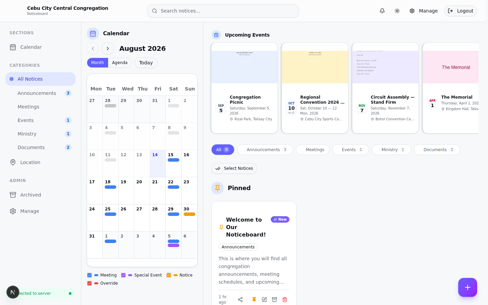
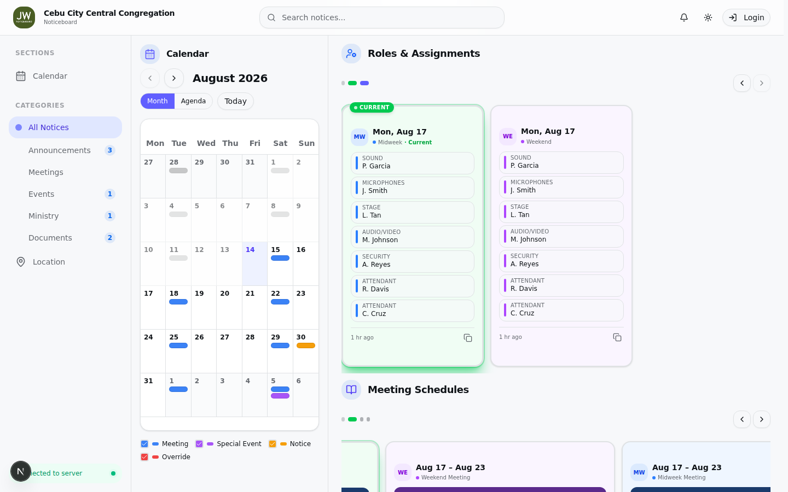
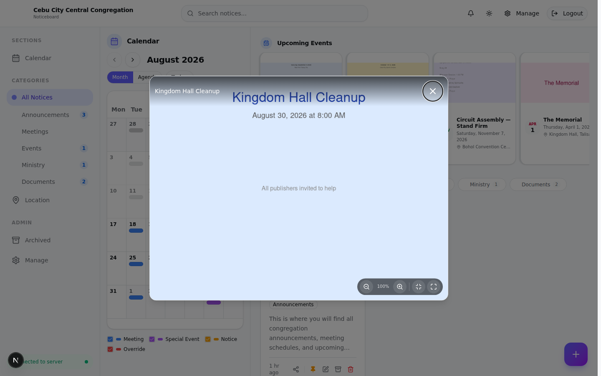
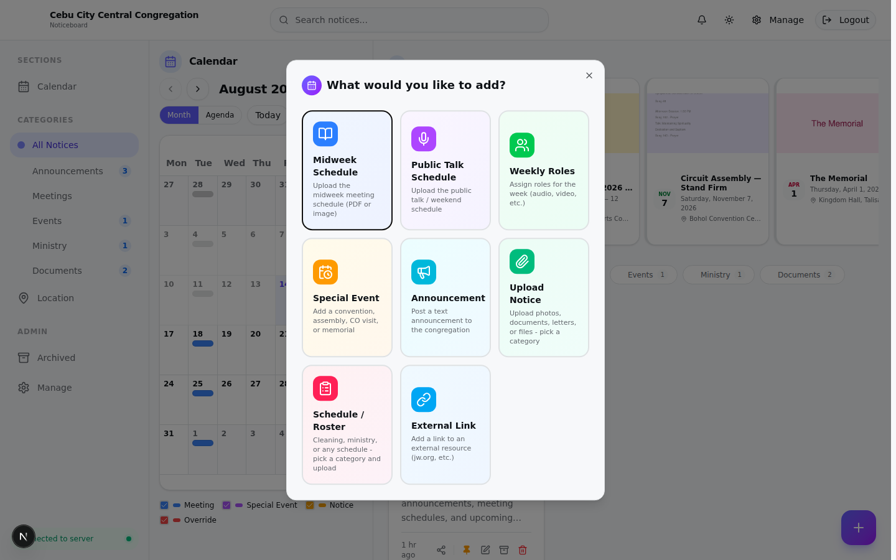
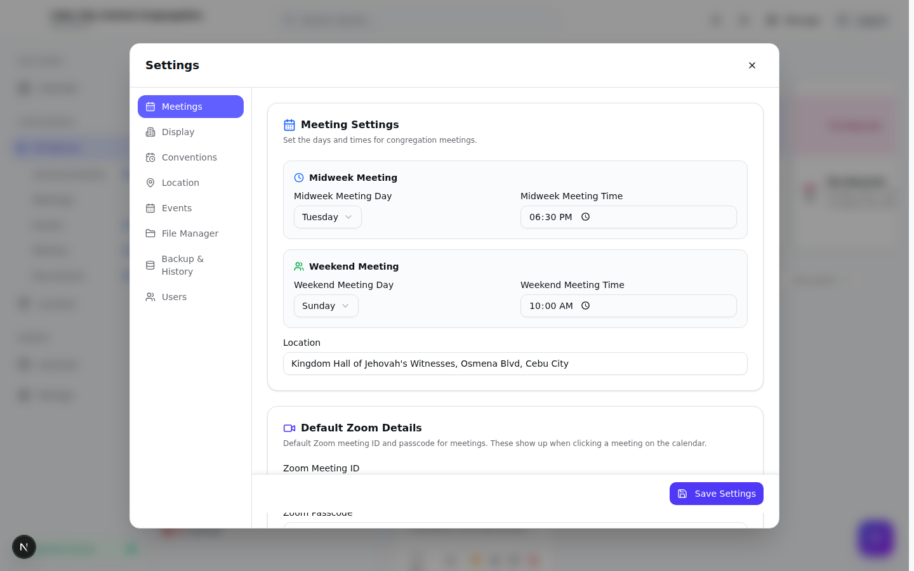
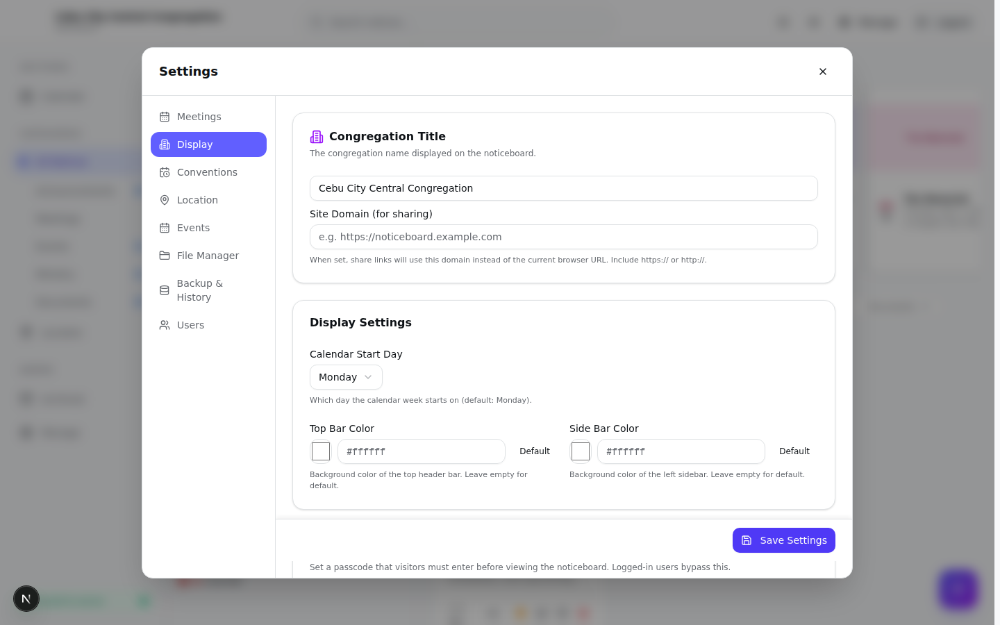
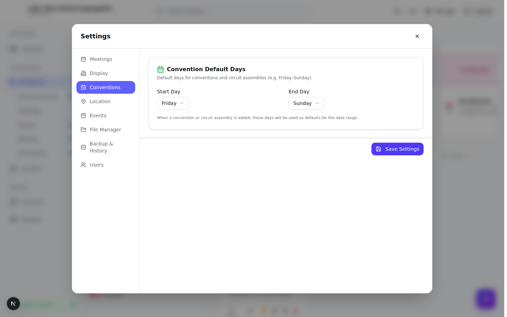
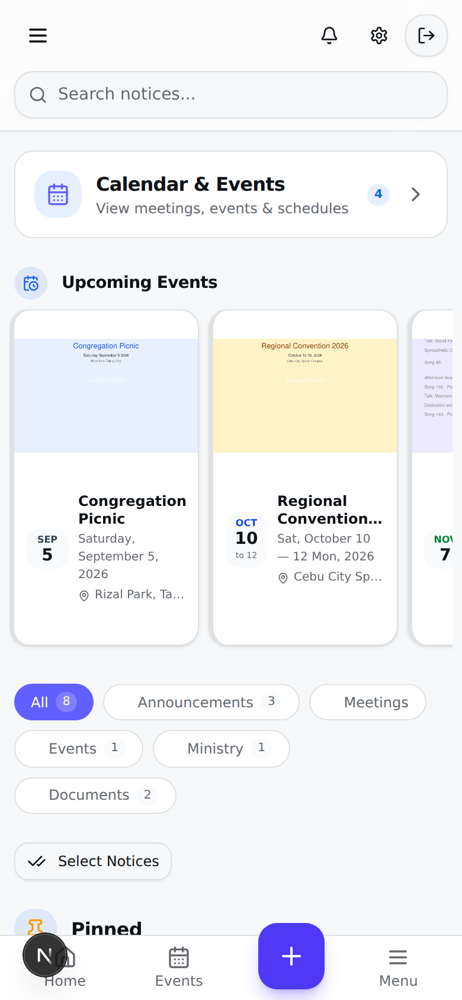
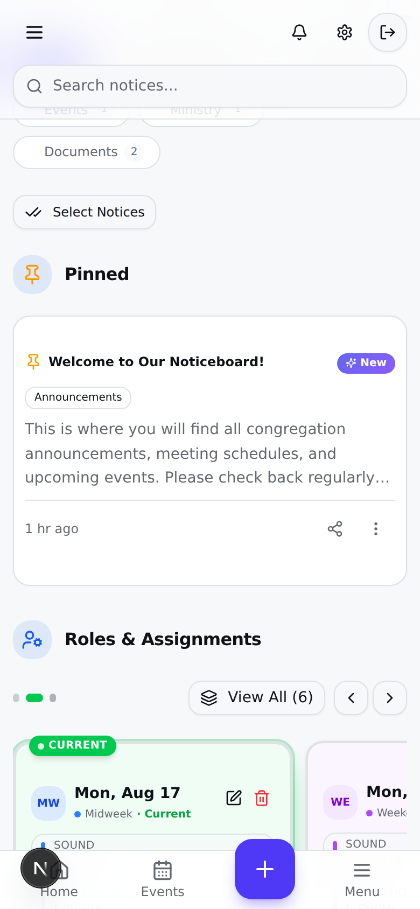
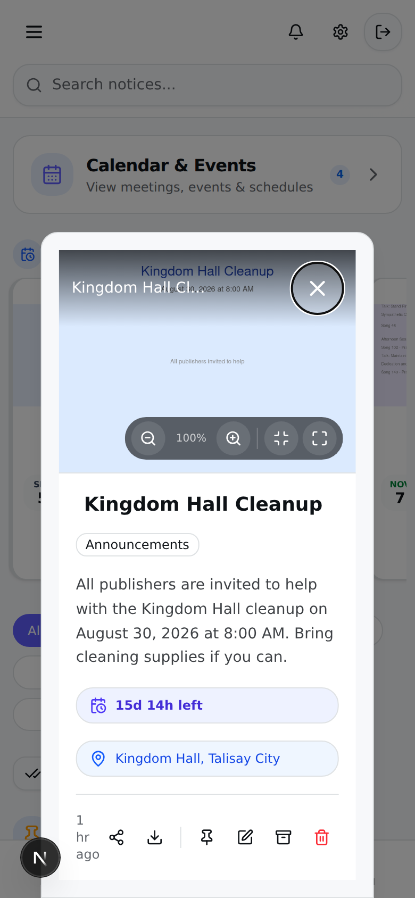

# Noticeboard

A standalone digital noticeboard application for congregations — built with Next.js, Prisma, and SQLite. Designed to run on a Raspberry Pi or any Docker host, with a responsive public-facing noticeboard and an admin panel for managing content.

## Screenshots

### Public Noticeboard


*The main noticeboard with congregation header, meeting info, and navigation.*

### Roles & Assignments


*Weekly role assignments for A/V and Security teams, with the current week highlighted.*

### Notice Detail Modal


*Clicking a notice opens a detail modal with the image and description. Use the expand button to view full-screen.*

### Add Item Picker (Admin)


*Admins can add notices, schedules, events, and role assignments from the floating + button.*

### Schedule Upload Modal (Admin)


*Upload meeting schedules with week selection (weeks, month, or date range picker).*

### Admin Settings — Meetings


*Configure meeting days, times, and congregation details.*

### Admin Settings — Display


*Customize the noticeboard appearance, theme, and display options.*

### Admin Settings — Conventions


*Set convention and assembly dates for automatic calendar integration.*

### Mobile View

<div style="display: flex; gap: 16px; flex-wrap: wrap;">



</div>

*Mobile views: noticeboard top, schedules, and detail modal.*

## Features

- **Notices** — Post text, images, PDFs, and links. Pin important notices, organize by category, attach date ranges and locations, and schedule expiry.
- **Meeting Schedules** — Upload midweek / public-talk schedules as PDFs or images, select weeks via calendar picker, and display them in a carousel that highlights the current week.
- **Role Assignments** — Upload assignment sheets (image/PDF), enter role text manually or via AI prompt paste, and display weekly roles on the noticeboard.
- **Special Events** — Track conventions, assemblies, CO visits, memorials, and other events with dates, locations, map links, and countdowns.
- **Calendar** — Month view showing meetings, events, and notices with `showOnCalendar` enabled.
- **Bookmarks** — Visitors can bookmark notices (synced to server when logged in).
- **Live Updates** — Server-Sent Events push instant updates to all connected clients when anything changes.
- **Auth & Roles** — NextAuth-based login with `super_admin`, `admin`, and `user` roles. Per-module permissions for restricted users. Optional passcode protection for the public noticeboard.
- **File Management** — Uploads stored as BLOBs in the database (DB-served via `/api/files/[id]`) or on disk in `public/uploads/`.
- **Backup & Restore** — One-click SQLite backup download and restore history.
- **Action Logs** — Audit trail of create/update/delete/login/logout actions.
- **Multi-language** — English and Tagalog (`en` / `tl`) support for titles, descriptions, and interface strings.
- **Theming** — Light, dark, and modern themes.
- **PWA** — Installable with a service worker and web manifest.

## Tech Stack

| Layer       | Technology                                      |
| ----------- | ----------------------------------------------- |
| Framework   | Next.js 16 (App Router, standalone)              |
| Language    | TypeScript 5, React 19                          |
| Styling     | Tailwind CSS 4, Radix UI primitives             |
| Database    | SQLite via Prisma 6                             |
| Auth        | NextAuth (credentials provider, bcrypt)         |
| Maps        | Leaflet / react-leaflet                         |
| PDF         | pdfjs-dist (CDN-loaded)                         |
| Icons       | lucide-react                                    |
| Container   | Docker (multi-arch: AMD64 + ARM64)              |

## Quick Start

### Option 1: Docker (recommended)

```bash
# 1. Create a .env file from the template
cp .env.example .env  # then edit values

# 2. Build and run
docker compose up -d --build

# 3. Open the app
#    http://localhost:2424
```

The container persists data in two named volumes:
- `noticeboard-db` — SQLite database at `/app/data/noticeboard.db`
- `noticeboard-uploads` — Uploaded files at `/app/public/uploads`

### Option 2: Local development

```bash
# 1. Install dependencies
npm install --legacy-peer-deps

# 2. Set up the database
npx prisma generate
npx prisma db push    # or: npm run db:migrate

# 3. Start the dev server
npm run dev
#    → http://localhost:3003
```

### Environment Variables

Create a `.env` file in the project root:

```env
# Super Admin credentials (used on first run to seed the admin user)
ADMIN_EMAIL=admin@example.com
ADMIN_PASSWORD=change-me

# NextAuth
NEXTAUTH_SECRET=generate-a-random-secret
NEXTAUTH_URL=http://localhost:3003

# App
PORT=3003
SESSION_TIMEOUT_HOURS=720

# Database (SQLite file path)
DATABASE_URL=file:./data/noticeboard.db
```

## Project Structure

```
noticeboard/
├── src/
│   ├── app/
│   │   ├── page.tsx              # Public noticeboard (main UI)
│   │   ├── admin/page.tsx        # Admin dashboard
│   │   ├── login/page.tsx        # Login page
│   │   ├── layout.tsx            # Root layout
│   │   ├── providers.tsx         # Client providers (NextAuth, toasts)
│   │   └── api/                  # REST API routes
│   │       ├── notices/          # CRUD for notices
│   │       ├── meetings/         # Meeting schedules
│   │       ├── events/           # Special events
│   │       ├── roles/            # Role assignments
│   │       ├── categories/       # Categories
│   │       ├── settings/         # App settings (key-value)
│   │       ├── upload/           # File upload endpoint
│   │       ├── files/            # DB-served file endpoint
│   │       ├── stream/           # SSE for live updates
│   │       ├── backup/           # Backup download
│   │       ├── export/           # Data export
│   │       ├── bookmarks/        # Bookmark sync
│   │       ├── calendar/         # Calendar data
│   │       ├── auth/             # NextAuth handlers
│   │       ├── admin/users/      # User management
│   │       ├── action-logs/      # Audit logs
│   │       └── health/           # Health check
│   ├── components/
│   │   ├── modals/               # Schedule, media, link, announcement,
│   │   │                         # notice-detail, weekly-roles, special-event
│   │   ├── shared/               # File upload zone, week selector,
│   │   │                         # advanced options, PDF thumbnail
│   │   ├── ui/                   # Radix-based UI primitives
│   │   ├── calendar/             # Calendar view
│   │   ├── meetings/             # Meeting manager
│   │   ├── events/               # Event manager
│   │   ├── roles/                # Roles panel
│   │   └── ...
│   ├── hooks/                    # use-toast, use-language
│   └── lib/                      # db, auth, i18n, rate-limit, utils
├── prisma/
│   └── schema.prisma             # Database schema
├── public/                       # Static assets, favicons, PWA manifest
├── Dockerfile                    # Multi-stage build (AMD64 + ARM64)
├── docker-compose.yml            # Production compose config
├── docker-entrypoint.sh          # DB init + migrations on startup
└── next.config.ts                # Standalone output, server actions
```

## Database Schema

The Prisma schema defines these models:

- **User** — Auth users with roles (`super_admin`, `admin`, `user`) and per-module permissions
- **Setting** — Key-value app settings (congregation title, meeting days/times, passcode, etc.)
- **Category** — Notice categories with optional Tagalog names, icons, and colors
- **Notice** — The core content entity (text, image, PDF, link) with pinning, archiving, scheduling, location, and gallery support
- **NoticeRead** — Read receipts per user per notice
- **MeetingSchedule** — Midweek/weekend meeting times and schedule files
- **MeetingOverride** — One-off meeting day/time changes or cancellations
- **SpecialEvent** — Conventions, assemblies, CO visits, memorials
- **RoleAssignment** — Weekly meeting roles with role text
- **RoleTemplate** — Reusable role templates
- **SavedLocation** — Geocoded saved locations for quick reuse
- **Bookmark** — Per-user notice bookmarks
- **UploadedFile** — File BLOBs stored in the database
- **BackupLog** — Backup history
- **ActionLog** — Audit trail

## npm Scripts

| Script              | Description                          |
| ------------------- | ------------------------------------ |
| `npm run dev`       | Start dev server on port 3003        |
| `npm run build`     | Production build                     |
| `npm run start`     | Start production server on port 3003 |
| `npm run lint`      | Run ESLint                           |
| `npm run db:push`   | Push schema to database              |
| `npm run db:generate` | Regenerate Prisma client           |
| `npm run db:migrate`| Create and apply a migration         |
| `npm run db:reset`  | Reset database (destructive)         |

## Roles & Permissions

| Role          | Access                                                    |
| ------------- | --------------------------------------------------------- |
| `super_admin` | Everything, including user management and backups         |
| `admin`       | Full content management (notices, events, roles, settings)|
| `user`        | Restricted to modules granted in `permissions` JSON array |

The public noticeboard is viewable without login unless a `noticeboardPasscode` is set in settings.

### Super Admin Protection

- The super admin's **username and role cannot be changed** — not via the UI or the API
- Super admin accounts **cannot be deleted**
- New users created by a super admin can only be assigned the **`admin`** role (the `user` role is no longer available for new accounts)
- These restrictions are enforced both in the frontend (disabled fields) and the backend (API returns 400 errors)

## API Overview

All API routes are under `/api/`. Key endpoints:

| Method  | Endpoint                  | Description                     |
| ------- | ------------------------- | ------------------------------- |
| GET     | `/api/notices`            | List notices (visitor/public)   |
| POST    | `/api/notices`            | Create notice                   |
| PUT     | `/api/notices/[id]`       | Update notice                   |
| DELETE  | `/api/notices/[id]`       | Delete notice                   |
| GET     | `/api/meetings`           | List meetings                   |
| GET     | `/api/events`             | List special events             |
| GET     | `/api/roles`              | List role assignments           |
| GET     | `/api/categories`         | List categories                 |
| GET     | `/api/settings`           | Get all settings                |
| POST    | `/api/upload`             | Upload a file                   |
| GET     | `/api/files/[id]`         | Serve a DB-stored file          |
| GET     | `/api/stream`             | SSE stream for live updates     |
| GET     | `/api/health`             | Health check                    |
| GET     | `/api/backup`             | Download SQLite backup          |
| GET     | `/api/calendar`           | Calendar data for a month       |

## Deployment

### Docker (production)

The `docker-compose.yml` is configured for production:
- Runs on port `2424` (configurable via `PORT` env var)
- 256 MB memory / 0.5 CPU limit (suitable for Raspberry Pi)
- Health check on `/api/health` every 30s
- Logs rotated at 10 MB / 3 files
- Auto-restarts unless stopped

```bash
# Build and start
docker compose up -d --build

# View logs
docker compose logs -f

# Stop
docker compose down

# Update to a new version
git pull
docker compose up -d --build
```

### Fast builds with buildx (recommended)

Use `docker buildx build` with GitHub Actions cache for significantly faster rebuilds.
The included `build.sh` script handles this automatically:

```bash
# Build for native platform (loads into docker so compose can use it)
./build.sh

# Then run with compose (uses the cached image, no rebuild needed)
docker compose up -d
```

#### `build.sh` options

The script supports environment variables for customization:

| Variable     | Default              | Description                                      |
| ------------ | -------------------- | ------------------------------------------------ |
| `IMAGE_NAME` | `noticeboard-app`    | Docker image name                                |
| `IMAGE_TAG`  | `latest`             | Docker image tag                                 |
| `PLATFORM`   | *(native)*           | Target platform, e.g. `linux/arm64` or `linux/amd64,linux/arm64` |
| `PUSH`       | `false`              | Set to `true` to push to a registry              |
| `LOAD`       | `true`               | Set to `false` to skip loading into docker (auto-disabled for multi-platform) |

Examples:

```bash
# Build for Raspberry Pi (ARM64)
PLATFORM=linux/arm64 ./build.sh

# Build with a custom tag
IMAGE_TAG=v1.2.3 ./build.sh

# Multi-platform build and push to a registry
PLATFORM=linux/amd64,linux/arm64 PUSH=true IMAGE_NAME=myregistry/noticeboard-app ./build.sh
```

You can also run buildx directly:

```bash
# Single-platform build with GHA cache
docker buildx build --cache-to type=gha --cache-from type=gha -t noticeboard-app:latest .

# Cross-compile for Raspberry Pi (ARM64)
docker buildx build --platform linux/arm64 --cache-to type=gha --cache-from type=gha -t noticeboard-app:latest .

# Multi-platform build + push to registry
docker buildx build --platform linux/amd64,linux/arm64 --push -t myregistry/noticeboard-app:latest .
```

### Raspberry Pi

The Dockerfile is multi-arch (AMD64 + ARM64) and optimized for Raspberry Pi 5. Build on the Pi directly:

```bash
docker compose up -d --build
```

Or use buildx for cross-compilation from another machine:

```bash
docker buildx build --platform linux/arm64 --cache-to type=gha --cache-from type=gha -t noticeboard-app:latest .
```

### Netlify

A `netlify.toml` is included for optional deployment on Netlify (note: SQLite/Prisma requires a persistent volume, so Docker is recommended for production).

## AI Image Processing (Optional)

The app can automatically read schedule images (Midweek Meeting / Public Talk) and fill in all the fields — speaker names, chairmen, prayers, talk themes, etc. — using Google Gemini AI.

### Setup

1. Get a **free** Gemini API key at [aistudio.google.com/apikey](https://aistudio.google.com/apikey)
2. Sign in with a Google account and click "Create API Key"
3. Copy the key (starts with `AIza...`)
4. In the app: **Settings → Display → AI Image Processing (Gemini)** → paste the key → Save

The key is stored in the database (not in `.env`) and is never exposed to non-admin users.

### Usage

When a Gemini API key is configured, schedule modals show an **"Auto-Process with AI"** button:

1. Click **Add → Midweek Schedule** or **Public Talk Schedule**
2. Upload the schedule image
3. Expand the **"AI Prompt & Paste"** section
4. Click **"Auto-Process with AI"** — the image is sent to Gemini, which returns structured JSON
5. Review the parsed fields and save

### Without an API key (manual mode)

If no key is set, you can still use the manual copy-paste method:

1. Click **"Copy for AI (prompt + image)"** — copies both the prompt text and the image to your clipboard
2. Paste into any AI chat (ChatGPT, Gemini, Claude, etc.)
3. Copy the JSON response from the AI
4. Paste it into the **"Paste AI JSON Output"** field
5. Click **"Parse & Fill"**

### Free tier limits

Gemini 2.0 Flash free tier: **15 requests/minute**, **1,500 requests/day**. No credit card required. This is more than enough for processing schedule images.

## Environment File

The `.env` file is git-ignored and never affected by `git pull`. A `.env.example` template is tracked in the repo for reference. To set up a new deployment:

```bash
cp .env.example .env
# Edit .env with your real values
```

| Variable                 | Description                              | Default                  |
| ------------------------ | ---------------------------------------- | ------------------------ |
| `ADMIN_EMAIL`            | Super admin email (used on first run)    | `admin@example.com`      |
| `ADMIN_PASSWORD`         | Super admin password (used on first run) | `change-this-password`   |
| `NEXTAUTH_SECRET`        | Random secret for JWT signing            | *(must change)*          |
| `NEXTAUTH_URL`           | Public URL of the app                    | `http://localhost:2424`  |
| `PORT`                   | Port to run on                           | `2424`                   |
| `SESSION_TIMEOUT_HOURS`  | Session expiry in hours                  | `720` (30 days)          |

> **Note:** The Gemini API key is **not** stored in `.env` — it's stored in the database via the Settings panel.

## License

Private project.
